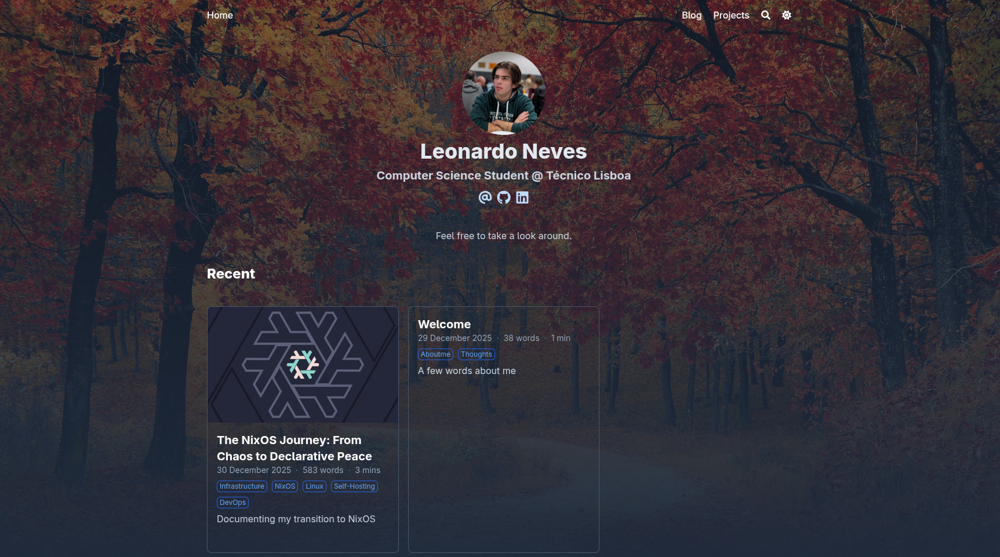

# Personal Website

The source code for my personal website and blog.

This site is built statically using [Hugo](https://gohugo.io/) and leverages the powerful [Blowfish](https://blowfish.page/) theme. It serves as a portfolio, a blog for my technical writings, and a playground for testing new infrastructure.

## 🚀 Tech Stack

- **Generator:** [Hugo](https://gohugo.io/) (Extended)
- **Theme:** [Blowfish](https://github.com/nunocoracao/blowfish)
- **Deployment:** NixOS VPS

## Preview

